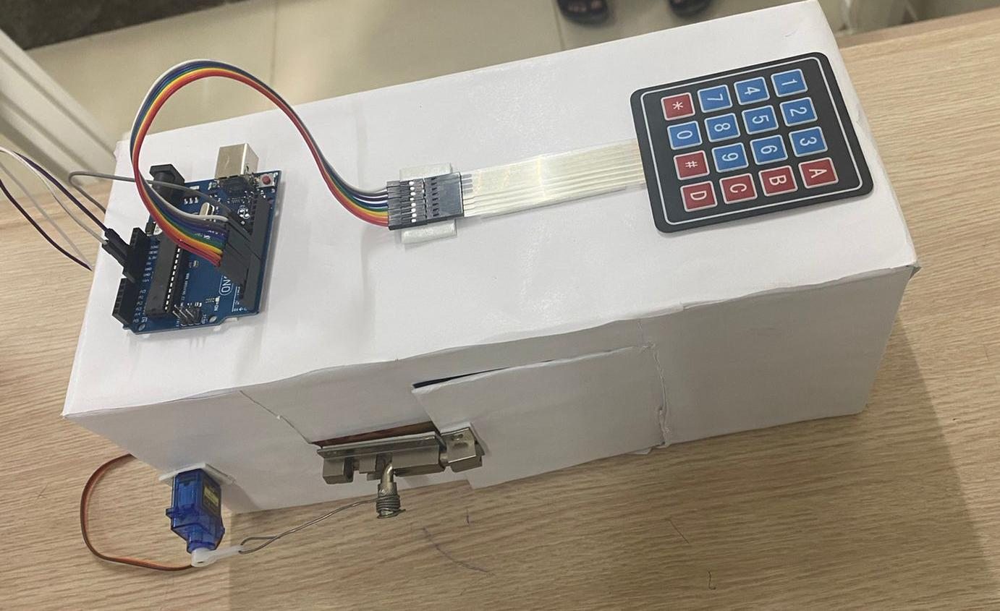

# 🔐 Password Door Lock System using Arduino Uno

This project is a smart security system that unlocks a door using a 4-digit password entered via a keypad. Built using Arduino Uno, this simple prototype simulates a secure door lock system ideal for homes, lockers, and access control.

---

## 🔧 Components Used:
- Arduino Uno
- 4x4 Matrix Keypad
- Servo Motor (SG90)
- Breadboard & Jumper Wires
- 9V Battery / USB Power
- (Optional) 16x2 LCD Display

---

## 🧠 Working Principle:
1. User enters a password via keypad.
2. If the password matches the stored code, the servo rotates and unlocks the door.
3. If incorrect, access is denied.
4. System can be extended to allow password changes, alarms, etc.

---

## 🖼️ Project Image:

---

## 💡 Applications:
- Home or Room Security
- Lab Lockers
- Mini ATMs or School Projects

---

## 📌 Future Improvements:
- EEPROM for dynamic password change
- GSM module to alert owner
- Fingerprint/Bluetooth module integration

---

## 👩‍💻 Team:
Santhiya Baskar  
B.Tech ECE  
Sri Manakula Vinayagar Engineering College
